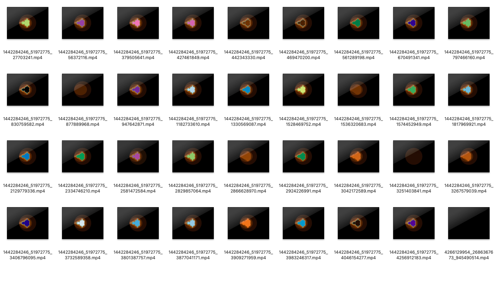
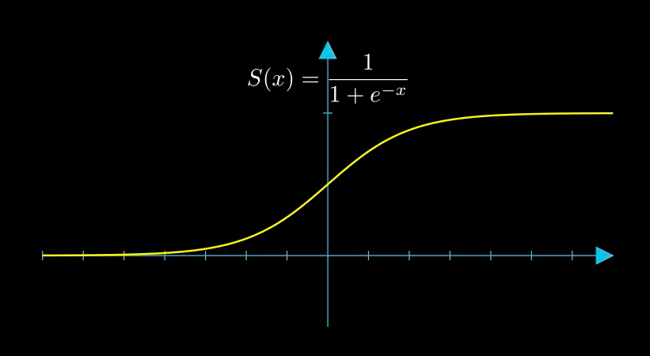

# What Manim Does:
Manim turns complex equations and mathematical abstractions into animations. It's a powerful tool for educators, students, or anyone wanting to visually explain a concept.

# Some Examples 
### Included in this repo





# Key Features:
Scene-Based: Animations are composed of a series of scenes, with each scene constructed using various objects and animations.
Mathematical Support: Manim has built-in support for rendering equations using LaTeX, making it perfect for mathematical animations.
Customizable: Almost every aspect of the visualizations can be customized.
Vector Graphics: Animations are rendered using vector graphics, allowing for perfect scalability.
## How to Install:

Manim has some dependencies, including LaTeX and FFmpeg.
You can install Manim using pip:
```
pip install manim
```

- LaTeX needs to be installed to render animations: (MAC) Install MacTeX using Homebrew:
```
brew install --cask mactex-no-gui
```
Find and Add to Path:

```
sudo find / -name latex
echo 'export PATH="/usr/local/texlive/2023/bin/x86_64-darwin:$PATH"' >> ~/.zshrc
source ~/.zshrc
```

Test succesfull install:

```
latex --version
```
If versions appear than you can proceed rendering the manim animations.

## Basic Usage:
Write a Python script using Manim's classes and functions to describe the animation.
Run the script using the Manim command-line interface to produce a video file.
Example:
Let's say you have the following script (example.py):

```
from manim import *

class CreateCircle(Scene):
    def construct(self):
        circle = Circle()
        self.play(FadeIn(circle))

```
You would render it with:

```
manim -pql example.py CreateCircle
```
This would create and play (-p) a low-quality (-l) video of the CreateCircle scene.

Notebook Usage:
Manim can also be used in Jupyter notebooks with the manim IPython magic command.

First, you'd need to install the Jupyter extensions:

```
pip install manim[ipython]
```

Then, in a Jupyter notebook, you can use:
%load_ext manim
Afterwards, you can run Manim code in cells using %%manim.

### Example in Jupyter:
```
%%manim -ql -v WARNING CreateCircle
from manim import *

class CreateCircle(Scene):
    def construct(self):
        circle = Circle()
        self.play(FadeIn(circle))
```

Running Manim on Your PC:
Install Manim and its dependencies.
Write a script detailing the animations using Manim's classes.
Run the script using the Manim CLI or within a Jupyter notebook.
Notes:
The Manim community is active and has a lot of resources online including documentation, forums, and tutorials.
There are different versions of Manim, including Manim Community Edition (CE) and Manim GL. Ensure you're referring to the correct documentation/version.