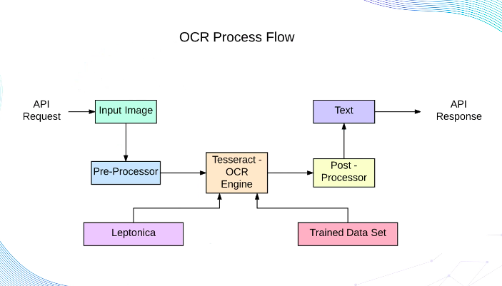
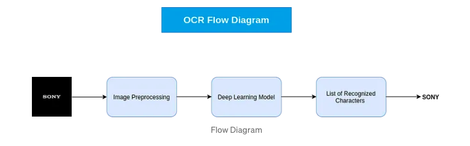
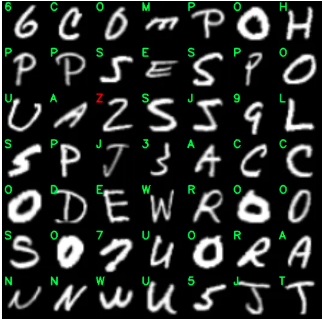
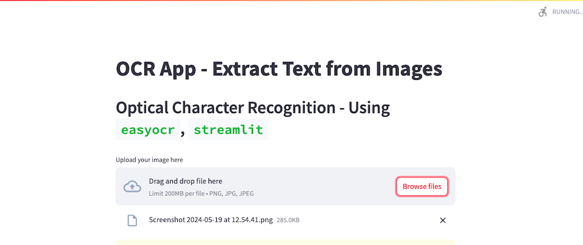
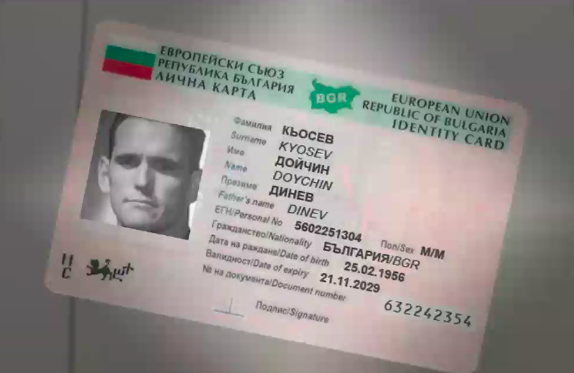
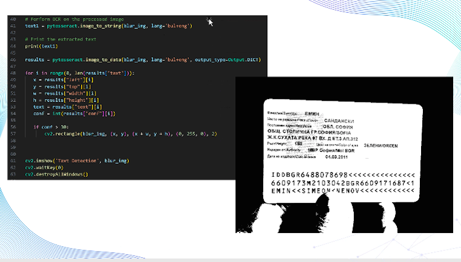
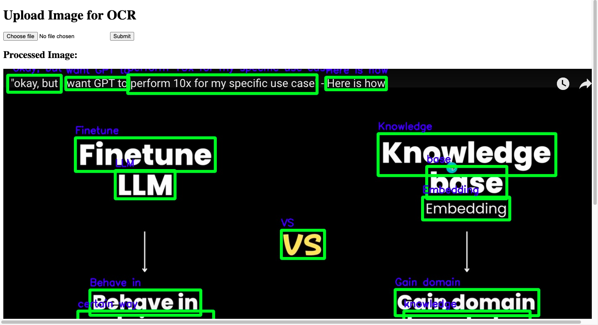

# OCR

## Example

# OCR App with Streamlit and Flask

- In this repo are two versions of an OCR (Optical Character Recognition) application: 
    one built with Streamlit and another with Flask. 
- OCR technology is used to convert different types of documents, such as scanned paper documents or PDFs, into editable and searchable data.

## How OCR Works

OCR works by detecting the text present in images and converting them into editable text data. 
The `easyocr` library, which utilizes deep learning models, is employed here to handle the OCR tasks. 
We can use `TesnorFlow` as well as pytesseract
It processes the input images to detect and interpret written text.

## Project Structure

- `streamlitapp.py`: The Streamlit version of the app with simple UI,displaying the data in order from the top.
- `flaskapp.py`: The Flask prototype of the app. Only ploting the text over the imgs

## Streamlit App

The OCR UI application allows users to upload an image and extracts text from the image using the `easyocr` library.

### Features

- Image uploading.
- Display of the uploaded image.
- Text recognition and display.

### How to Run the Streamlit App

1. Ensure you have Python installed on your system.
2. Install the required libraries: with pip freeze -> requirements.txt
import easyocr as ocr  #OCR
import streamlit as st  #Web App
import numpy
from PIL import Image #Image Processing
import numpy as np #Image Processing 
import matplotlib.pyplot as plt to plot the photo with labels
 
