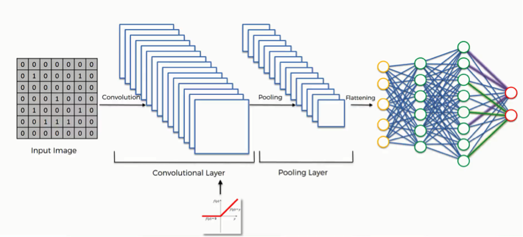
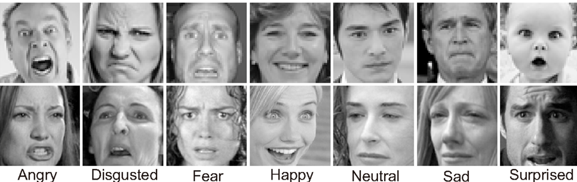

## ML, ChatBots, Algo Trading, Games, Apps

# Python Programming Language

Python is an interpreted, high-level, general-purpose programming language. It was created by Guido van Rossum and first released in 1991. The language constructs and object-oriented (OOP) approach aim to help programmers write clear, logical code for small and large-scale projects.

## Usage
Python is used in diverse areas such as:

- Web and Internet Development
- Scientific and Numeric computing (matplotlib, scipy, numpy)
- Education (Python is a great language for beginner programmers)
- Desktop GUIs
- Software & Game development
- Network Programming
- Data Analysis
- Machine Learning
- Trading
- Testing / Automation
Python is easy to pick up, but it's also powerful enough to run major websites like Pinterest and Instagram.




## Data Types: Python has five standard data types: Numbers, String, List, Tuple, Dictionary. For example:
```
num = 123 # This is a number
string = "Hello, World!" # This is a string
list = [1, 2, 3, "a", "b", "c"] # This is a list
tuple = (1, 2, "a", "b") # This is a tuple
dictionary = {"name": "John", "age": 30} # This is a dictionary
Control Flow: Python uses if, for, and while for control flow. For example:
python
Copy code
# Using if
x = 10
if x > 0:
    print("Positive")
```

### Using for
```
for i in range(5):
    print(i)
```
### Using while
```
i = 0
while i < 5:
    print(i)
    i += 1
```

## Comprehensions: Python provides compact syntax for deriving one list from another. For example:

### List comprehension
```
numbers = [1, 2, 3, 4, 5]
squares = [i**2 for i in numbers]
```
### Dictionary comprehension
```
square_dict = {i: i**2 for i in numbers}
```

## Decorators: 
A decorator is a design pattern in Python that allows a user to add new functionality to an existing object without modifying its structure. For example:
```
def decorator_function(original_function):
    def wrapper_function(*args, **kwargs):
        print(f"{original_function.__name__} function ran")
        return original_function(*args, **kwargs)
    return wrapper_function

@decorator_function
def display_info(name, age):
    print(f"{name} is {age} years old")

display_info("John", 25)
```
## Generators: 
Generators are a type of iterable, like lists or tuples. They do not allow indexing but they can still be iterated through with for loops. They are created using functions and the yield statement. For example:
```
def generator_function():
    for i in range(10):
        yield i

for item in generator_function():
    print(item)
```
Python has a robust ecosystem with a vast selection of libraries and frameworks. Some of the most popular include:

- For Web Development: Django, Flask
- For Data Analysis/ML: Pandas, Numpy, Matplotlib, Scikit-learn, Tensorflow, Scipy
- For Automation/Testing: Selenium, Pytest, Unittest
- For Trading: Zipline, Backtrader
- For Vision: DeepFace, HuggingFace, Keras

## Simple Linear Regression with TensorFlow

```
import numpy as np
import tensorflow as tf

# Data
X = np.array([1, 2, 3, 4, 5], dtype=float)
Y = np.array([2, 4, 6, 8, 10], dtype=float)  # Y = 2*X

# Model
model = tf.keras.models.Sequential([
    tf.keras.layers.Dense(1, input_shape=[1]),
])

# Compile the model
model.compile(optimizer='sgd', loss='mean_squared_error')

# Train the model
model.fit(X, Y, epochs=500)

# Predict
print(model.predict([10.0]))  # It should be close to 20
```
## A Convolutional Neural Network (CNN)
is a class of deep learning models, mainly used for image processing tasks. A CNN uses convolutional, pooling, and fully connected layers to process and learn from input data.

- Key Layers:

Convolutional Layer: Applies a specified number of convolution filters to the image.
Pooling Layer: Reduces the spatial size (width, height) to decrease processing time and control overfitting.
Fully Connected Layer: Produces the final classification from the features learned by the previous layers.
Here's a minimalistic example of a CNN using Keras:

```
from tensorflow.keras.models import Sequential
from tensorflow.keras.layers import Conv2D, MaxPooling2D, Flatten, Dense

model = Sequential([
    Conv2D(32, (3, 3), activation='relu', input_shape=(64, 64, 3)),
    MaxPooling2D(pool_size=(2, 2)),
    Flatten(),
    Dense(10, activation='softmax'),
])

model.compile(optimizer='adam', loss='categorical_crossentropy', metrics=['accuracy'])

```

This model is a basic CNN that includes a convolutional layer, a pooling layer, a layer to flatten the data, and a fully connected layer for classification. Replace input_shape and the last Dense layer's units as per your data.

## Simple Emotion Recognition via CNNs & TensorFlow



```
import numpy as np
import cv2
from tensorflow.keras.models import load_model
from tensorflow.keras.preprocessing import image

# Load the pre-trained model
model = load_model('emotion_model.h5')

# Define emotion classes
class_labels = ['Angry','Happy','Neutral','Sad','Surprise']

# Load an image for testing
# The model expects images in the size of (48,48)
img = image.load_img("test.jpg", grayscale=True, target_size=(48, 48))

# Convert image to numpy array
x = image.img_to_array(img)
x = np.expand_dims(x, axis = 0)

# Normalize the image array
x /= 255

# Predict the emotion
predictions = model.predict(x)
max_index = np.argmax(predictions[0])
predicted_emotion = class_labels[max_index]

print(predicted_emotion)
```


